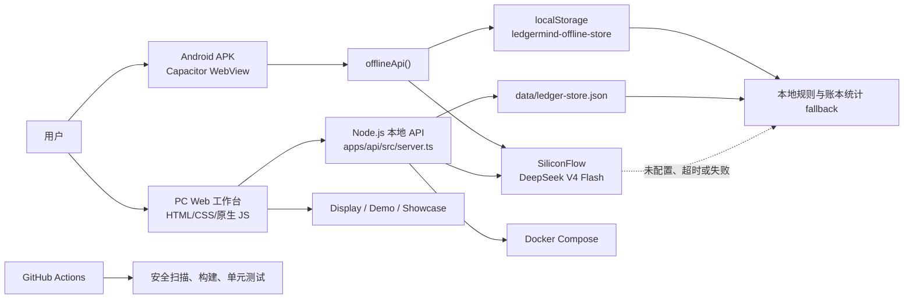
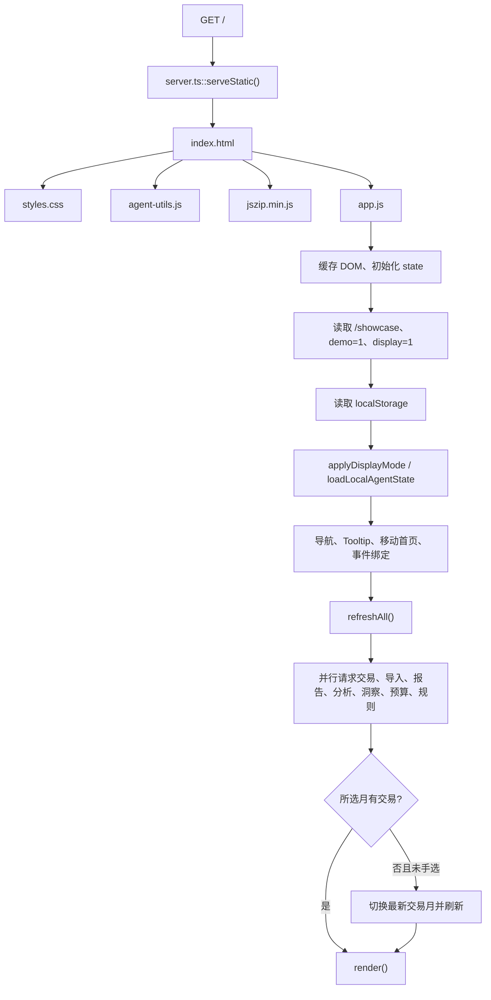
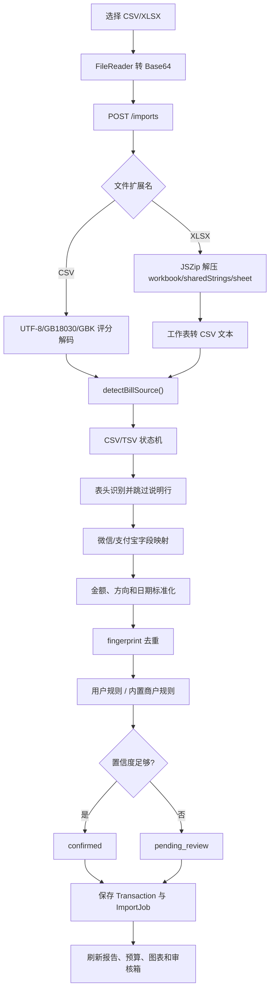
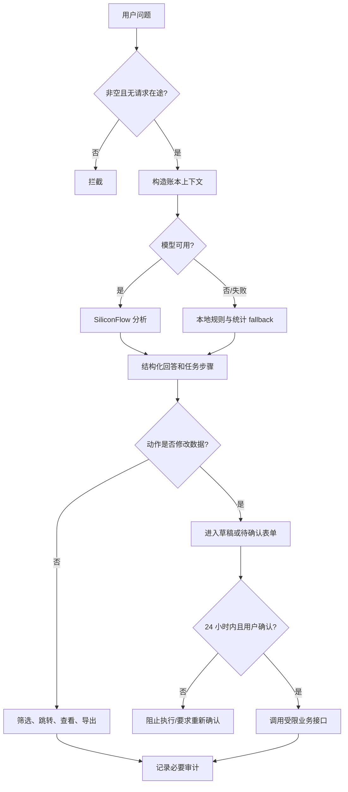

# LedgerMind OS 开发规格说明书 DEV_SPEC

> 文档对应仓库版本：`0.1.0`。本文以当前仓库代码为最终事实来源；README、Release Notes 中无法由仓库独立复现的结果会明确标记。

## 1. 文档目的与事实来源

本文不是产品宣传页，而是 LedgerMind OS 的开发、学习和复盘基线，面向以下读者：

- 第一次接触项目、需要建立完整心智模型的开发者；
- 需要维护解析器、账本领域逻辑、Web UI 或 Android 端的贡献者；
- 计划增加账单格式、模型提供商、同步能力或发布流水线的二次开发者；
- 需要在面试中解释架构取舍、数据流和安全边界的项目作者。

事实来源按可信度排序：

1. 当前仓库实际代码与配置；
2. `packages/**/*.test.ts` 测试断言；
3. `README.md`、`docs/`、`CHANGELOG.md` 和 Release Notes；
4. 前置《LedgerMind OS 项目信息盘点报告》。

本次盘点执行结果：

- `npm test` 实测 **24/24** 通过；命令先运行 TypeScript 构建，再运行 `node --test dist/**/*.test.js`。
- `npm run check:release` 实测通过，共检查 **121 个 Git 文件**。
- 微信 XLSX `98/98`、`412×915` 与 `390×844` 移动视口、APK Signature Scheme v2 签名通过，均为 README/Release Notes 的文档记录。仓库没有对应真实 XLSX、自动化视口测试或 APK 签名测试，当前无法独立复现。
- Dockerfile 与 Compose 配置完整，但本次未实际启动容器验证，不能把“配置存在”等同于“当前环境运行通过”。

文中使用以下措辞区分结论：

- “代码实现”：可定位到当前源码；
- “测试覆盖”：存在自动测试断言；
- “文档记录”：仅由文档声称；
- “当前版本暂未实现/当前代码中未确认”：仓库内不存在充分实现证据。

## 2. 项目概述

- 项目名称：LedgerMind OS。
- npm 包名：`auto-ledger-agent-os`。
- 当前版本：`0.1.0`。
- 定位：本地优先的中文自动记账与财务智能体工作台。

项目解决的不是单纯“录入一笔账”，而是账单汇聚后的治理问题：不同平台账单格式不一、分类质量不稳定、低置信度记录需要人工处理、AI 建议不能直接改账、修改过程需要可追溯、整理后的数据还要生成预算、洞察和报告。

目标用户包括需要整理微信/支付宝账单的个人用户、希望离线管理账本的隐私敏感用户，以及研究 Agent 安全执行闭环的开发者。

PC Web 是完整工作台，通过同源 Node API 使用本地 JSON 账本；Android APK 是 Capacitor 容器，内嵌同一套 Web 资源，在没有 PC 后端时由 `offlineApi()` 和设备 `localStorage` 提供账本能力。

本地优先体现在：

- PC 默认将状态写入 `data/ledger-store.json`；
- Android 默认写入 `ledgermind-offline-store`；
- 草稿、审计和导出记录保存在当前浏览器/设备；
- 没有模型 Key或云端失败时，问答回退到账本统计和规则分析；
- JSON 备份和 CSV 导出可由用户自行保管。

AI 智能体负责解释数据、组织任务步骤和提出上下文动作，不拥有任意写账权限。项目闭环为：

```text
账本导入 → 自动分类 → 智能审核 → Agent 任务流 → 待执行草稿
→ 用户确认 → 受限操作执行 → 操作审计 → 报告输出
```

当前版本边界：单机、无实时多端同步；只兼容部分微信/支付宝 CSV/XLSX；无 OCR；本地 fallback 是规则与统计而非本地大模型；Android 为 Debug APK；无正式权限系统、自动 UI 测试和自动 GitHub Release。

## 3. 系统整体架构



主要运行面：

- PC Web：导入、交易、审核、预算、规则、Agent、报告、诊断和导出。
- Node API：静态文件、账本 CRUD、解析编排、聚合、模型代理。
- Android：复用 Web UI；原生层仅负责 WebView 容器和 Capacitor 能力。
- 模型：PC 由服务端代理，Android 离线模式可从设备直接调用 SiliconFlow。
- 展示体系：Display 只改变呈现；Demo 写入独立用户；Showcase 是静态展示页。
- 工程体系：Docker 提供 PC 服务容器化；CI 只做安全扫描、构建与单元测试。

## 4. 仓库目录结构

```text
apps/
  api/src/server.ts
  web/public/{index.html,styles.css,app.js,agent-utils.js,jszip.min.js,...}
packages/
  shared/src/
  parsers/src/
  ledger/src/
  core/src/
android/
scripts/
docs/
.github/workflows/ci.yml
samples/bills/
data/
dist/
```

### 4.1 `apps/api/src/server.ts`

Node HTTP 服务入口，职责包括加载 `.env`、实例化 `LedgerAgentOS`、暴露 REST 风格接口、处理 CSV/XLSX、代理 SiliconFlow、提供 `/health` 和静态文件。它是 PC 运行路径的应用层，不是领域模型本身。

### 4.2 `apps/web/public`

- `index.html`：桌面与移动页面骨架、Showcase、弹层、导航和表单。
- `styles.css`：主题、响应式布局、移动安全区、Bottom Sheet、图表和状态样式。
- `app.js`：约 218 KB，包含状态、事件、渲染、导入、Agent、离线 API、Android 适配。
- `agent-utils.js`：草稿 namespace、24 小时过期、审计脱敏与上限、质量评分、规则匹配等可测试纯函数。
- `jszip.min.js`：浏览器离线解析 XLSX 所需的第三方产物。
- `manifest.webmanifest`、`icon.svg`：Web 应用元数据与图标。

### 4.3 `packages/shared/src`

`types.ts` 定义 Transaction、Budget、ClassificationRule、ImportJob、MonthlyReport、Analytics 和 Insights 等领域契约；`id.ts` 生成业务 ID。新人应先读这里建立词汇表。

### 4.4 `packages/parsers/src`

- `csv.ts`：CSV/TSV 状态机、分隔符与表头识别。
- `detect.ts`：账单来源判断。
- `wechat.ts`、`alipay.ts`：平台字段映射。
- `money.ts`：金额和方向标准化。
- `index.ts`：解析入口。
- `parsers.test.ts`：匿名样例验证。

### 4.5 `packages/ledger/src`

- `import-workflow.ts`：解析、指纹去重、分类、ImportJob 生成。
- `classifier.ts`：用户规则和内置商户规则。
- `fingerprint.ts`：交易去重指纹。
- `budget.ts`：预算计算。
- `analytics.ts`：每日、商户和分类聚合。
- `insights.ts`：退款、转账候选。
- `recurring.ts`：周期扣费候选。
- `report.ts`：月报。
- 同目录测试覆盖主要纯业务逻辑。

### 4.6 `packages/core/src/agent-os.ts`

内存状态与 JSON 持久化服务，组合 parser 和 ledger 包，提供导入、交易修改、规则学习、预算、报告、洞察、导出和用户清理。虽然类名为 Agent OS，它主要是领域应用服务，并不直接调用大模型。

### 4.7 Android、脚本和文档

- `android/app/src/main/assets/public/`：`cap sync` 复制的 Web 资源。
- `MainActivity.java`：Capacitor `BridgeActivity`，配置 WebView 缩放和 viewport。
- `AndroidManifest.xml`：网络权限、单任务 Activity、`adjustResize`。
- `app/build.gradle`、`variables.gradle`：包名、SDK、依赖和构建类型。
- `scripts/release-check.mjs`：扫描密钥、私密产物和本地绝对路径。
- `docs/`：架构、隐私、Demo、Roadmap、截图与 Release Notes。
- `.github/workflows/ci.yml`：手动触发的 Node 24 CI。

### 4.8 根目录文件

`package.json`、`package-lock.json`、`tsconfig.json`、`capacitor.config.ts`、Dockerfile、Compose、`.env.example`、`.gitignore`、`.dockerignore`、README、CONTRIBUTING、CHANGELOG 和 MIT LICENSE 构成构建与发布基线。

核心阅读优先级：`types.ts` → `agent-os.ts` → `import-workflow.ts` → parsers/ledger → `server.ts` → `index.html` → `app.js`。

## 5. 运行、构建与环境配置

```bash
npm install
npm start
npm test
npm run build
npm run test:unit
npm run check:release
npm run dev:api
```

`npm start` 和 `npm run dev:api` 都先构建，再运行 `dist/apps/api/src/server.js`。PC 地址为 <http://localhost:8787/>。

```bash
docker compose up --build
docker compose down

npm run android:sync
npm run android:apk
```

Android Debug APK 输出到 `android/app/build/outputs/apk/debug/app-debug.apk`。JDK 21 和 Android SDK 是 README 声明的构建前提。当前 `android:apk` 脚本调用 `npm.cmd` 和 `gradlew.bat`，仅能在 Windows 环境直接运行；Linux/macOS 需要改用对应的 npm 命令与 `./gradlew assembleDebug`，仓库目前未提供跨平台脚本。

功能 URL：

- 正常工作台：<http://localhost:8787/>
- 展示模式：<http://localhost:8787/?display=1>
- Demo 账本：<http://localhost:8787/?demo=1>
- Showcase：<http://localhost:8787/showcase>

`.env.example`：

```dotenv
PORT=8787
SILICONFLOW_BASE_URL=https://api.siliconflow.cn/v1
SILICONFLOW_MODEL_NAME=deepseek-ai/DeepSeek-V4-Flash
SILICONFLOW_API_KEY=
GITHUB_REPO_URL=
```

Windows PowerShell 复制方式：

```powershell
Copy-Item .env.example .env
```

`GITHUB_REPO_URL` 是发布元数据占位；页面实际读取 `index.html` 的 `github-repo-url` meta，当前代码没有自动把环境变量写入 HTML。

## 6. 技术栈说明

- Web：HTML、CSS、原生 JavaScript、DOM API、Fetch API。
- 后端：TypeScript、Node.js `http`/`fs`/`path`。
- Android：Capacitor 8、Android Gradle Plugin 8.13、Java `BridgeActivity`；minSdk 24、compile/target 36。
- 文件：自研 CSV/TSV 状态机、`TextDecoder`、JSZip 3.10.1。
- AI：OpenAI-compatible chat completions，默认 `deepseek-ai/DeepSeek-V4-Flash`。
- 图表：DOM、CSS 渐变、进度条和环形表现，无第三方图表库。
- 测试：Node `node:test`。
- Docker：Node 24 bookworm-slim 多阶段镜像，runtime 使用非 root `node` 用户。
- CI：GitHub Actions + Node 24。

这些技术减少了运行依赖，便于静态资源进入 Capacitor WebView，也使核心纯函数可直接用 Node 测试。代价是前端缺少组件、路由和模块化状态框架；`app.js` 较大，PC 与 Android 离线端还重复实现部分领域逻辑，长期维护成本高于组件化、共享包驱动的方案。

## 7. 核心数据模型

### 7.1 Transaction

```json
{
  "id": "txn-123",
  "userId": "demo-user",
  "source": "wechat",
  "sourceTransactionId": "wx-order-1",
  "importJobId": "import-123",
  "accountId": "optional-account",
  "direction": "expense",
  "amount": 36.5,
  "currency": "CNY",
  "paidAt": "2026-05-06 18:20:00",
  "merchantName": "示例餐厅",
  "counterparty": "示例餐厅",
  "productName": "晚餐",
  "paymentMethod": "零钱",
  "categoryId": "food.restaurant",
  "tags": [],
  "rawDescription": "原始行字段拼接",
  "normalizedDescription": "示例餐厅 - 晚餐",
  "confidence": 0.86,
  "status": "confirmed",
  "createdAt": "2026-05-06T10:20:00.000Z",
  "updatedAt": "2026-05-06T10:20:00.000Z"
}
```

`source` 支持微信、支付宝、银行卡、现金、手工和发票等类型定义，但当前导入主流程实际重点支持微信、支付宝；`direction` 为 income、expense、transfer、refund、unknown；`status` 为 pending_review、confirmed、ignored。

创建位置：`importBill()`、`LedgerAgentOS.createManualTransaction()`、Demo 生成和 Android `offlineApi()`。更新位置：单笔/批量分类、状态接口。它是预算、报告、图表、质量、健康度和审核箱的共同事实源。

PC 持久化在 `data/ledger-store.json`；Android 位于 `ledgermind-offline-store.transactions`。真实与 Demo 通过 `userId` 隔离；Display 不复制交易，只改变呈现。

### 7.2 Budget

```json
{
  "id": "budget-user-2026-05-food.coffee",
  "userId": "user",
  "month": "2026-05",
  "categoryId": "food.coffee",
  "limitAmount": 500,
  "createdAt": "...",
  "updatedAt": "..."
}
```

`LedgerAgentOS.upsertBudget()` 按 `userId + month + categoryId` 更新或创建。预算用于 BudgetStatus、审核箱、健康度、月底预测和报告中心。PC 存 JSON，Android 存 offline store；Demo 按 `ledgermind-demo` 用户隔离。

### 7.3 Rule / ClassificationRule

```json
{
  "id": "rule-123",
  "userId": "user",
  "categoryId": "transport.taxi",
  "matchType": "contains",
  "field": "merchantName",
  "pattern": "滴滴",
  "priority": 120,
  "createdAt": "...",
  "updatedAt": "..."
}
```

`matchType` 为 contains/equals；`field` 可匹配 merchantName、counterparty、productName、rawDescription。`classifyTransaction()` 过滤同用户规则、按 priority 倒序，第一个命中项决定分类。规则可由 `/automation-rules` 显式创建，也可由用户修正分类学习。PC/Android 分别持久化到 rules 数组。

### 7.4 Agent Memory

当前没有独立 `AgentMemory` 类型、表或数组。“智能体记忆”实质上是 ClassificationRule，加上前端根据规则及命中交易派生的解释。若未来需要保存偏好来源、版本、衰减或冲突，应新增正式模型，不能继续把 UI 文案当作数据模型。

### 7.5 Import Batch / ImportJob

```json
{
  "id": "import-123",
  "userId": "user",
  "source": "wechat",
  "filename": "微信支付账单.xlsx",
  "status": "completed",
  "totalRows": 98,
  "importedRows": 96,
  "duplicateRows": 2,
  "reviewRows": 8,
  "errors": [],
  "createdAt": "...",
  "updatedAt": "..."
}
```

状态类型定义为 created、parsing、classified、completed、failed，但当前同步导入实现最终主要生成 completed/failed。交易通过 `importJobId` 关联批次，用于批次详情和筛选。PC/Android 分别保存 jobs；当前版本无原子批次撤销。

### 7.6 Draft Action

```json
{
  "id": "pending-123",
  "type": "创建分类规则",
  "title": "把滴滴自动归为交通",
  "impact": "未来同类交易",
  "risk": "执行前需确认规则内容",
  "source": "智能体建议",
  "draft": "把滴滴自动归为交通",
  "action": "create-rule",
  "createdAt": "...",
  "expiresAt": "..."
}
```

这是前端安全模型，未定义在 `types.ts`。`enqueuePendingAction()` 创建，最多保存 50 条；`confirmPendingAction()`、`reconfirmPendingAction()`、取消和清空更新。键为 `ledgermind-agent-drafts:<namespace>`。

### 7.7 Audit Log

```json
{
  "id": "audit-123",
  "time": "...",
  "type": "智能体建议",
  "title": "创建交通分类规则",
  "source": "智能体",
  "impact": "未来同类交易",
  "result": "已建议",
  "detail": ""
}
```

`appendAuditLog()` 将新项放在首位、截取 100 条，并将 `sk-...` 替换为 `[已隐藏 Key]`。存储键为 `ledgermind-agent-audit:<namespace>`。

### 7.8 Report / MonthlyReport

```json
{
  "userId": "user",
  "month": "2026-05",
  "income": 5000,
  "expense": 1800,
  "net": 3200,
  "transactionCount": 42,
  "pendingReviewCount": 3,
  "categories": [
    {"categoryId":"food.restaurant","income":0,"expense":500,"count":10}
  ]
}
```

MonthlyReport 是正式类型，由交易即时生成，不单独持久化。预算、订阅、质量和导出记录报告是报告中心基于 budgets、insights、质量计算和本地 exports 派生的视图。

### 7.9 Quality Score

```json
{
  "rows": 42,
  "pending": 3,
  "unclassified": 2,
  "duplicates": 0,
  "missingMerchant": 1,
  "budgetCoverage": 0.6,
  "ruleCoverage": 0.4,
  "recentImport": true,
  "anomalies": 1,
  "score": 86
}
```

它由 `calculateDataQuality()` 动态计算，不持久化；无交易返回 `null`。

### 7.10 Health Score

Health Score 没有正式共享类型或后端字段，由 `renderLedgerHealth()` 在 UI 侧根据分类/确认、待确认、预算风险和异常因素动态呈现。无交易显示 `--` 和“等待评估”，避免展示虚假高分。

### 7.11 Demo Ledger / Display Mode

- Demo 用户固定为 `ledgermind-demo`，账本数据实际写入对应用户。
- Display namespace 固定为 `display-mode`，只隔离草稿、审计和导出表现。
- 真实 namespace 为 `user-<userId>`，Demo 为 `demo-ledger`。

## 8. PC Web 初始化与页面渲染流程



初始化先缓存表单、导航、弹层等 DOM；读取 `/showcase`、`?demo=1`、`?display=1`；建立 `state`，其中保存 transactions、jobs、report、analytics、insights、budgets、rules、pendingActions、auditLogs、exportRecords 等。

读取的 localStorage 包括：月份、主题、展示模式、API Base、模型 Key、引导状态和 Agent namespace 数据。随后调用：

1. `applyDisplayMode()`；
2. `loadLocalAgentState()`；
3. `installGroupedNavigation()`；
4. `installModuleHelp()`；
5. `setMobilePage("home")`；
6. 安装月份、搜索、导入、Agent、规则、预算、导航等事件；
7. `refreshAll()`。

`refreshAll()` 先 `/health`，再并行请求 `/transactions`、`/imports`、`/reports/monthly`、`/analytics/monthly`、`/insights`、`/budgets/status`、`/classification-rules`。若用户未手选月份且该月无交易，会切换到最新交易月份。

`render()` 统一驱动主要视图：`renderFirstRunGuide`、`renderDiagnostics`、`renderAnalytics`、`renderWorkflow`、`renderReviewInbox`、`renderMemoryPanel`、`renderLedgerHealth`、`renderDataQuality`、`renderAuditLogs`、`renderMonthlyReport`、`renderReportCenter`、`renderJobs`、`renderTransactions`、`renderBudgets`、`renderRules`、`renderInsights`、`renderMobileHome`。

## 9. 账单导入全链路



前端 `importFile()` 只接受 `.csv`/`.xlsx`，读取 Base64 后发送用户、文件名和内容。服务端 CSV 用 `TextDecoder` 尝试 UTF-8、GB18030、GBK，以替换字符数量和中文字符数量评分；XLSX 用 JSZip 读取 workbook、关系、shared strings 和工作表 XML，再送入相同文本解析链路。

`detectBillSource()` 检查文件名和前 2000 字符：微信/WeChat/交易单号判为微信，支付宝/Alipay/交易号判为支付宝，否则 unknown。

CSV 状态机支持逗号或 Tab、双引号、转义引号和换行。`findHeaderIndex()` 查找同时含时间、金额、交易主体关键词的行，因此表头之前的导出说明自然被跳过；若找不到则退回第一行多列记录。

微信映射包括交易时间、金额、收/支、交易单号、商户单号、交易对方、商品和支付方式；支付宝映射包括交易创建时间、付款时间、金额、收/支、交易号、商家订单号、交易对方、商品说明和交易状态。

`parseAmount()` 清除非数字、点、负号，解析后取绝对值。`parseDirection()` 按支出、收入、转账、退款关键词判断，否则 unknown。CSV 日期基本保留原值；XLSX 离线流程另有 Excel serial 转日期函数。

`importBill()` 对已有交易指纹和本批内部指纹去重。新记录先以置信度 0.5、pending_review 构造，再进入分类器。最终创建 ImportJob，`importJobId` 写入每笔交易。

错误处理：未知来源产生 failed job；单行解析异常写入 `errors` 并跳过；存在解析错误时 job 为 failed；HTTP 层对编码、XLSX、网络和加密/损坏文件返回中文提示。当前同步实现可能已经生成部分有效交易但 job 状态为 failed，二次开发应明确是否需要事务性语义。

Android 使用 `parseOfflineCsvTransactions()` 和 `parseOfflineXlsxTransactions()`，并没有直接复用 TypeScript parser。这使 APK 可离线运行，但会产生格式支持、错误语义和分类结果的双实现漂移风险。

## 10. 交易管理模块

`renderTransactions()` 同时生成桌面表格和移动卡片。`filteredTransactions()` 先按 `paidAt.startsWith(month)` 限定月份，再按 status 和 `importJobId` 过滤；搜索覆盖 merchantName、counterparty、productName、categoryId、中文分类名和 rawDescription。

单笔分类由 `createCategorySelect()` 发起 `PATCH /transactions/:id`；批量分类把勾选 ID 发送到 `PATCH /transactions/batch`。状态修改由 `PATCH /transactions/:id/status` 完成。确认使用 confirmed，忽略使用 ignored；重新编辑回到分类控件或详情。删除前调用 `window.confirm`，然后 `DELETE /transactions/:id`，不可恢复。

`openTransactionDetails()` 打开桌面抽屉/移动 Bottom Sheet，展示完整时间、来源、状态、分类、置信度、解释和操作；移动列表由 `transactionCard()` 构造。

所有成功修改调用 `syncAfterChange()` → `refreshAll()`，因此指标、图表、月报、预算、审核箱、健康度、质量评分和规则命中都会从最新数据重新派生，而不是手工局部修补多个视图。

## 11. AI 自动分类、规则和智能体记忆

分类顺序固定为：

1. 同用户 ClassificationRule，按 priority 倒序；
2. 内置商户关键词规则；
3. 未命中保持待确认。

用户规则命中时 confidence 至少 0.96，状态 confirmed；内置规则命中时至少 0.86；未命中时 confidence 不高于 0.6，状态 pending_review。内置关键词覆盖咖啡、餐饮、滴滴/出租、超市、视频订阅和房租。

`reasonFor()` 根据状态和分类生成“需要确认”“商户符合餐饮模式”等 UI 文案。它不是模型推理链，也不是可验证的规则证据，不能在文档中称为大模型解释。

`parseRuleCommand()` 从“把滴滴自动归为交通”等中文命令或英文 categorize/as 形式提取 pattern，并用关键词映射 categoryId；无法识别具体分类时默认 `life.daily`。显式创建前有确认框。

`ruleMatchesTransaction()` 按规则 field/matchType 计算命中，`renderRules()` 显示总命中次数和最近命中日期。用户通过 `updateTransactionCategory()` 修正分类后，`LedgerAgentOS` 会创建或更新基于商户/对方的规则，这就是当前“学习记忆”。

“转为规则”只调用 `prepareRuleDraft()` 填充规则输入框，因为规则会影响未来同类交易，潜在影响范围大于当前单笔；用户必须再次确认创建。

## 12. 智能审核箱

审核箱由 `renderReviewInbox()` 动态合并以下事项：

| 类型 | 触发条件 | 主要操作 |
| --- | --- | --- |
| 待确认交易 | `status === pending_review` | 确认、改分类、忽略、删除、查看详情 |
| 低置信度 | `confidence < 0.75` | 修改或确认分类 |
| 高额消费 | expense 且金额 ≥ `max(500, 月支出×25%)` | 查看详情、确认或忽略 |
| 预算风险 | BudgetStatus 为 warning/over | 跳转预算、调整额度 |
| 周期扣费 | recurring candidate | 查看相关交易、审核订阅 |

交易项显示风险标签、商户/商品、金额、分类、置信度等；预算项显示已用额度和风险；周期项显示商户、金额、周期和出现次数。

直接交易操作通过 API 修改并全量刷新。会扩大影响范围的规则、预算或删除规则建议进入草稿/表单；建议、确认、取消和回退事件可写入审计日志。

## 13. 智能体问答与 Agent 任务流

`askAgent()` 先 trim 问题；空问题拦截，`agentAskInFlight` 防止重复提交，并禁用桌面/移动按钮。请求体包含 userId、month、question，目标为 `/agent/ask`。

服务端模型上下文包括：MonthlyReport、分类 Top 8、商户 Top 8、周期扣费 Top 8、最近 20 笔交易、月份和问题。最近交易包含时间、商户、商品、方向、金额、分类和状态。

模型请求为 OpenAI-compatible `/chat/completions`：默认模型 DeepSeek V4 Flash，`temperature=0.25`、`max_tokens=900`。PC 使用 `.env` 的 Key，由服务端请求；Android 离线模式从 `ledgermind-siliconflow-key` 读取并直接请求。

超时边界存在差异：PC 服务端请求通过 `AbortSignal.timeout(30000)` 设置 30 秒超时；Android 普通 Fetch 使用 `AbortController` 和定时器实现 30 秒超时；CapacitorHttp 分支没有显式设置 30 秒超时，当前代码中未确认插件是否有独立默认超时。

无 Key、超时、网络异常或空响应会回退 `buildLocalAgentAnswer()`/`buildOfflineAgentAnswer()`。本地分析通过问候、订阅、节省、餐饮、总结等关键词选择模板；节省空间按月支出 8% 估算，不是预测模型。

回答呈现为结论、重点发现、建议操作、数据来源、模型来源、指标卡片、上下文动作和任务步骤。`agentTaskSteps()` 根据问题关键词生成只读任务流，`inferAgentActions()` 生成筛选、跳转、填表和导出动作。



安全动作可直接跳转、筛选、查看或导出；规则、预算和删除类修改不能由模型任意执行。审计会记录任务流、模型来源、本地回退、建议及确认结果。

## 14. 待执行草稿箱

草稿箱把“AI 生成建议”和“真实账本变更”拆成两个步骤，防止模型输出被误当作执行授权。当前实际进入草稿箱的事项包括分类规则建议、预算提醒、周期扣费规则草稿、禁用分类记忆，以及数据质量模块生成的批量分类建议。月报导出目前由 Agent 动作直接调用 `exportMonthlyReportMarkdown()`，没有实际进入草稿箱。

存储键格式：

```text
ledgermind-agent-drafts:user-<userId>
ledgermind-agent-drafts:demo-ledger
ledgermind-agent-drafts:display-mode
```

`enqueuePendingAction()` 设置 `createdAt` 与 `expiresAt=createdAt+24h`。`confirmPendingAction()` 发现过期即阻止执行；`reconfirmPendingAction()` 要求用户重新确认内容和影响范围，再重置 24 小时。

单条取消通过 ID 从数组移除并写审计；一键清空先二次确认，只删除草稿、不修改账本。移动端使用同一响应式列表。这套设计的重要性在于：时间会改变账本状态和影响范围，因此旧建议不应永久拥有执行资格。

## 15. 操作审计日志

审计记录智能体建议、任务流生成、云端失败回退、规则创建确认、草稿确认/取消/重新确认/清空和部分导出行为。`appendAuditLog()` 生成 id/time，并只保留最近 100 条。

所有文本经过：

```text
sk-... → [已隐藏 Key]
```

日志结构不包含账单原文或导入文件字段，设计上只记录标题、来源、影响、结果和 detail。但这目前是调用约定而非 TypeScript 强类型或字段白名单强制；未来应在写入边界增加允许字段和长度限制。

`renderAuditLogs()` 展示日志；清空前确认并将当前 namespace 写为空数组。展示模式使用独立 `display-mode` namespace，不读取真实用户审计。

## 16. 预算、账本健康度和数据质量

预算花费只统计同用户、同月、同分类、direction=expense 的交易：

```text
spent = Σ expense.amount
remaining = limitAmount - spent
usageRatio = spent / limitAmount
ok: ratio < 0.8
warning: 0.8 ≤ ratio < 1
over: ratio ≥ 1
```

月底预测使用 `projected = spent / monthProgress`，当前月进度为当前日/当月天数。对非当前月份的业务含义应增加边界测试，当前代码中未确认其是否符合产品预期。

健康度由 UI 动态计算，没有共享 Health 类型，也不持久化。实际公式为：

```text
score = classifiedRate × 40
  + (1 - pendingRate) × 25
  + (1 - budgetRiskRate) × 15
  + (1 - lowConfidenceRate) × 15
  + (1 - duplicateRate) × 5
```

其中依次衡量分类完整率、非待确认率、无预算风险率、非低置信度率和非重复率；它不直接使用退款、转账或周期扣费候选数量。无交易时显示 `--`、“等待评估”和引导文案。

数据质量满分 100：非待确认 25、非未分类 20、非重复 15、商户完整 10、预算覆盖 10、规则覆盖 10、近期导入 5、异常控制 5。`rows<=0` 返回 null。

修复建议阈值：pending>8%、unclassified>5%、duplicates>0、missingMerchant>3%、budgetCoverage<50%、ruleCoverage<25%、无近期导入、anomalies>2。建议通常执行筛选、跳转或准备草稿，而不是直接批量改账。

## 17. 图表与洞察

- 每日趋势：按日期累计 expense，缺失日期补零。
- 分类占比：分类 expense / 总 expense。
- Top 商户：按商户汇总 expense 和次数并降序。
- 来源分布：按微信、支付宝、手工等聚合。
- 收支构成：income、expense、refund、transfer。
- 状态构成：pending_review、confirmed、ignored。

图表由 DOM、CSS donut gradient 和进度条生成，无第三方图表库；`empty()` 统一处理无数据状态。移动端复用相同聚合数据，改为卡片和紧凑图形。

转账候选要求同用户、金额差小于 0.005、时间在 24 小时内，并含转账/充值/提现/余额/还款等信号或方向为 transfer。退款候选要求同商户、退款不超过原支出、间隔不超过 60 天。周期扣费按商户+分类+金额分组，至少两次，平均间隔 25–40 天且每次偏差不超过 5 天；两次 confidence 0.72，三次以上 0.88。

## 18. 报告中心与导出

报告中心包含月度、预算、订阅、数据质量和导出记录 Tab。月度报告来自 `generateMonthlyReport()`；预算来自 BudgetStatus；订阅来自 recurring candidates；质量来自前端评分；导出记录来自本地 exports namespace。

`buildMonthlyReportMarkdown()` 把月度指标和分类列表组成中文 Markdown，并通过 `agent-utils.buildMarkdown()` 保证末尾换行。摘要复制使用 Clipboard API；失败会显示提示。

PC CSV 由 `/exports/transactions.csv` 输出 UTF-8 BOM，JSON 备份由 `/exports/backup.json` 返回当前用户 transactions、jobs、rules、budgets。Android 分别由 `exportOfflineTransactionsCsv()` 和 `exportOfflineBackup()` 本地生成。

导出记录保存于：

```text
ledgermind-agent-exports:<namespace>
```

Display 中 `money()` 返回 `¥••••`，商户经 `displayName()` 替换为示例商户 A/B/C，Agent 回答使用固定示例。二次开发必须确保导出函数不会因 UI 脱敏而被误认为已经自动脱敏原始文件；当前代码主要保证展示层脱敏。

## 19. 展示模式、演示账本和 Showcase

`display=1` 或 `ledgermind-display-mode=true` 开启展示。真实用户 ID 暂存于 `userIdInput.dataset.realValue`，输入框显示“演示用户”且只读。金额显示 `¥••••`，商户稳定映射到 A/B/C，健康度、审核箱和 Agent 可显示固定完整示例。退出时恢复真实 ID和先前回答。

`demo=1` 调用 `loadDemoLedger()`：先清理 `ledgermind-demo` 用户，再导入匿名样例、创建手工交易、规则和预算。原用户写入 `ledgermind-demo-return-user`，清除 Demo 后恢复。Demo 是真实隔离数据，不是纯 UI 假数据。

`/showcase` 或 `#showcase` 隐藏 app shell、移动 Agent 输入和导航，仅显示静态产品展示，不执行正常账本初始化。

README 截图保存在 `docs/images/`；`docs/SCREENSHOTS.md` 建议 PC 1440×1024、移动 412×915、深色主题和 Display 模式。当前没有自动截图依赖。

## 20. 快速说明和新用户引导

快速开始把首次操作压缩为导入账单、处理待确认、询问 Agent 和查看报告。`renderNextActions()` 根据当前账本状态给出最多 3 条优先建议，避免用户先理解所有模块。

- 首次引导 key：`ledgermind-seen-onboarding`；非 Display 且未见过时自动打开。
- 快速面板关闭 key：`ledgermind-quick-start-dismissed`。
- 功能地图可从设置重新打开。
- `installModuleHelp()` 为模块安装 Tooltip/说明入口。
- `installGroupedNavigation()` 对侧边栏功能分组。

这些设计用“下一步任务”代替纯功能菜单，降低财务术语、Agent 安全机制和多模块联动带来的理解成本。

## 21. Android APK 端实现

Android 不是独立原生 UI，而是 Capacitor 容器中的同一套 Web 应用。资源位于 `android/app/src/main/assets/public/`；`MainActivity.java` 继承 `BridgeActivity`，关闭 WebView 缩放并配置 viewport；Manifest 允许网络访问，Activity 使用 `adjustResize`、singleTask 和可调整尺寸。

移动页面为首页、交易、洞察、智能体和设置，由 `setMobilePage()` 与底部导航切换。

离线壳判定包括 `file:`、`capacitor:`、`androidplatform.net` 和 Capacitor native platform。没有自定义 API Base 时，`api()` 直接调用 `offlineApi()`；若配置远程 API 但请求失败，Android 也回退离线 API。

`ledgermind-offline-store` schemaVersion 2：

```json
{
  "schemaVersion": 2,
  "transactions": [],
  "jobs": [],
  "rules": [],
  "budgets": []
}
```

离线端支持手工记账、CSV/XLSX 导入、分类、状态、删除、预算、报告、洞察、AI 问答、CSV 和 JSON 导出。模型 Key 存 `ledgermind-siliconflow-key`，未加密。

安全区和窄屏适配主要在 CSS；软键盘由 `adjustResize` 配合页面布局。构建命令为 `npm run android:sync` 和 `npm run android:apk`。

PC 与 Android 共享页面和交互，但 PC 使用 TypeScript 领域包与 JSON，Android 使用 `app.js` 内离线重实现；这是当前最重要的架构漂移风险之一。

## 22. 系统诊断

`renderDiagnostics()` 显示后端、模型、账本、预算、规则、记忆、最近 Agent、最近导入和 Display 状态。

- 后端：PC 实际请求 `/health`；Android offline `/health` 返回 `ledgermind-offline-mobile`。
- 模型：“已配置”主要根据是否存在 Key；成功/回退状态根据最近一次调用结果，不是独立连通性探测。
- 账本、预算、规则：来自当前实际 state 数量和状态。
- 导入：来自最近 ImportJob/`state.lastImport`。
- Display：来自真实布尔状态。
- 最近 Agent：只代表当前页面会话记录。

因此后端健康和账本计数属于实际检测；“模型已配置”只是配置检测，不能解释为模型服务在线；部分文案和 Display 示例属于静态/间接状态。

## 23. 安全、隐私与边界

- 本地优先不等于完全不联网。启用云问答时会向 SiliconFlow 发送月报汇总、Top 分类/商户、周期扣费和最近 20 笔交易，隐私说明必须突出这一事实。
- PC Key 来自 `.env`；Android Key 位于 localStorage，未加密，不应在共享设备保存高权限密钥。
- 审计对 `sk-...` 脱敏，发布扫描也检测疑似 Key。
- Display 脱敏用户名、商户、金额和 Agent 预览，但不能替代导出前检查。
- 修改建议进入草稿或待确认表单。自然语言规则创建前会弹出确认框，从待执行草稿触发的规则删除也经过草稿确认；但规则列表中的直接删除操作当前调用 `deleteRule(rule)`，没有二次确认。交易删除有确认且不可恢复。
- 智能体只能调用预定义上下文动作，不能执行任意代码或任意账本变更。
- 批量分类在 UI 有明确选择和操作，但是否对所有批量动作都实施一致二次确认应继续审计；不能泛称所有批量操作都有强确认。
- 批次撤销暂未实现。架构文档给出的理由是避免多笔删除中断导致部分提交；根本问题是当前 JSON 服务没有事务和批次回滚机制。
- Android 为 Debug APK；公开分发前需要 Release keystore、`signingConfig`、安全密钥管理、版本策略、AAB 和商店发布流程。

## 24. 测试与质量保障

测试文件：

- `packages/core/src/agent-os.test.ts`：8 项领域服务测试；
- `packages/core/src/agent-utils.test.ts`：8 项草稿、审计、质量和工具测试；
- `packages/ledger/src/*.test.ts`：分析、预算、导入、洞察和周期扣费；
- `packages/parsers/src/parsers.test.ts`：微信/支付宝匿名 CSV。

24 项覆盖：导入与月报、分类修正学习、批量分类和预算、手工交易、用户级去重、导出与规则删除、显式规则、单用户清理、namespace 隔离、24 小时过期、Key 脱敏、审计 100 条、空账本质量、修复代码、Markdown、规则匹配、每日/商户/分类分析、预算状态、微信导入去重、退款/转账、周期扣费、微信/支付宝样例。

“原 16/16”是除 `agent-utils.test.ts` 新增 8 项外的原业务测试。微信 XLSX 98/98 仅为文档记录，真实文件未提交。412×915、390×844 是人工视口验收，无 Playwright/Cypress/截图测试。

APK 可通过 `npm run android:apk` 构建。项目没有签名校验脚本；通常可使用：

```bash
apksigner verify --verbose --print-certs android/app/build/outputs/apk/debug/app-debug.apk
```

v2 通过仍仅为文档记录。

CI 仅 `workflow_dispatch`，使用 Node 24，依次运行 `npm ci`、release check、build、unit tests；不注入 Key、不构建 APK。

## 25. Docker、CI 与发布流程

Dockerfile 使用 builder/runtime 两阶段。builder 安装完整依赖并编译；runtime 只安装 production 依赖，复制 dist、Web 和 samples，创建 `/app/data`，切换到 `node` 用户，监听 8787。

Compose 映射 `8787:8787`，挂载 `./data:/app/data`，注入 SiliconFlow 配置，通过 Node fetch 检查 `/health`，并设置 `restart: unless-stopped`。

`.dockerignore` 排除 node_modules、dist、data、Git、环境文件、APK 和密钥；`.gitignore` 排除本地账本、导入文件、构建目录、APK/AAB、keystore 和 `.env`。

CI 只做手动质量门禁。仓库提供 MIT LICENSE、CONTRIBUTING、CHANGELOG 和 Release Notes，但没有自动 GitHub Release workflow。

建议发布流程：

1. 更新版本、CHANGELOG 和 Release Notes；
2. 执行 `npm test` 与 `npm run check:release`；
3. 实际启动 Docker 并检查 `/health`、导入和持久化；
4. 构建 Android Release/AAB，使用正式 keystore 签名并验证；
5. 完成人工 PC/移动响应式回归；
6. 创建 Git tag；
7. 通过 GitHub UI/CLI 创建 Release，上传经过扫描的产物和校验值。

## 26. 已知限制与技术债

1. 单机、本地优先，无实时多端同步。
2. Web/Node 与 Android 离线业务重复实现，存在解析、分类和错误语义漂移。
3. 账单格式覆盖有限，无法保证所有地区/时间导出变体。
4. 无 OCR 发票或票据识别。
5. 本地分析是规则和统计，能力显著弱于完整模型。
6. Android API Key 存 localStorage，未加密。
7. 无正式 Release 签名和 keystore 流程。
8. 无导入批次原子撤销。
9. 无自动 UI、响应式、可访问性和视觉回归测试。
10. CI 不在 push/PR 自动运行。
11. 无自动 GitHub Release。
12. Docker 配置存在，但本次未实际运行验证。
13. 文档 Docker 状态轻微不一致：README 标记已支持，Roadmap/旧 Release Notes 仍写完善或未来提供。
14. README Roadmap 把 Markdown 导出列为未完成，但 `buildMonthlyReportMarkdown()` 和导出按钮已经实现，应修正文档。
15. `app.js` 体积大，状态、渲染、网络、离线领域逻辑耦合。
16. ImportJob 定义含中间状态，但同步实现主要只产生 completed/failed。
17. 审计“不记录原文”主要依赖调用约定，没有强类型字段白名单。
18. Display 是展示层脱敏，不能自动保证所有导出文件脱敏。

## 27. Roadmap

- 扩展微信、支付宝和银行卡格式及版本化 parser fixtures。
- 增加导入预览、错误行下载、重试和事务性批次回滚。
- OCR 发票、收据和票据识别。
- 多 OpenAI-compatible 提供商、可选本地模型与统一超时策略。
- 端到端加密多端同步。
- 权限、审计字段白名单、数据保留和隐私控制。
- 图片月报及更稳定的报告模板。
- 插件系统与记账模板市场。
- 把 Android 离线领域逻辑迁移到可共享核心，减少双实现。
- 配置 Release keystore、AAB、版本签名和 Android 正式发布流水线。
- 增加 PR CI、UI/E2E、视口、导入 fixture 和 Docker 集成测试。

## 28. 新人学习路径

1. 阅读 `README.md` 与 `docs/ARCHITECTURE.md`，理解产品闭环。
2. 阅读 `packages/shared/src/types.ts`，掌握领域词汇。
3. 阅读 `packages/core/src/agent-os.ts`，理解状态与用例编排。
4. 阅读 `packages/ledger/src/import-workflow.ts`，理解导入总流程。
5. 阅读 `packages/parsers/src/*`，跟踪微信/支付宝行如何标准化。
6. 阅读 `classifier.ts`、`budget.ts`、`analytics.ts`、`insights.ts` 和 `recurring.ts`。
7. 阅读 `apps/api/src/server.ts`，把领域用例映射到 HTTP。
8. 阅读 `apps/web/public/index.html`，建立页面结构。
9. 分段阅读 `app.js`：初始化 → API → 导入 → 交易 → Agent → 草稿审计 → 报告 → offlineApi。
10. 对照全部测试复盘边界条件。
11. 最后阅读 Android、Docker、CI 和发布配置。

建议学习时用一笔交易贯穿全链路：解析字段 → 指纹 → 分类 → 状态 → 审核 → 修改 → 规则学习 → 聚合 → 报告。

## 29. 面试讲解提纲

1. **背景**：多平台账单格式异构，AI 建议存在误改账风险，需要本地优先和可审计闭环。
2. **架构**：PC Web + Node 本地 API + JSON；Android 用 Capacitor + offlineApi + localStorage。
3. **导入难点**：编码、说明行、表头、CSV 引号、XLSX XML、字段差异、去重和错误处理。
4. **自动分类**：用户规则优先、内置关键词次之、置信度决定是否人工审核。
5. **可解释性**：展示规则来源和置信度，但明确 `reasonFor()` 不是模型推理链。
6. **Agent 安全执行**：模型只产生回答和受限动作；修改进入草稿，24 小时后失效。
7. **审计**：记录建议、确认、取消和回退，限制 100 条并脱敏 Key。
8. **本地优先**：PC JSON、Android localStorage、模型失败本地 fallback；同时如实说明云问答上传上下文。
9. **Android**：共享 UI 降低交付成本，但离线业务双实现是技术债。
10. **质量**：24 项领域测试、发布扫描、Docker/CI；UI、真实 XLSX 和签名仍需自动化。
11. **规划**：共享离线核心、更多 parser fixtures、事务性导入、加密同步和正式移动发布。

## 30. 附录

### 30.1 常用命令

```text
npm install                  安装依赖
npm start                    构建并启动 PC 服务
npm run dev:api              构建并启动 API
npm run build                TypeScript 构建
npm test                     构建并运行全部测试
npm run test:unit            运行 dist 中测试
npm run check:release        发布安全扫描
docker compose up --build    构建并启动容器
docker compose down          停止容器
npm run android:sync         同步 Web 资源
npm run android:apk          构建 Debug APK
```

### 30.2 关键 URL

```text
http://localhost:8787/
http://localhost:8787/health
http://localhost:8787/?display=1
http://localhost:8787/?demo=1
http://localhost:8787/showcase
```

### 30.3 localStorage key

```text
theme
ledgermind-selected-month
ledgermind-display-mode
ledgermind-api-base
ledgermind-siliconflow-key
ledgermind-quick-start-dismissed
ledgermind-seen-onboarding
ledgermind-demo-return-user
ledgermind-offline-store
ledgermind-agent-drafts:<namespace>
ledgermind-agent-audit:<namespace>
ledgermind-agent-exports:<namespace>
```

namespace 为 `user-<id>`、`demo-ledger` 或 `display-mode`。

### 30.4 环境变量

```text
PORT
SILICONFLOW_BASE_URL
SILICONFLOW_MODEL_NAME
SILICONFLOW_API_KEY
GITHUB_REPO_URL
```

### 30.5 核心文件索引

| 文件 | 作用 |
| --- | --- |
| `packages/shared/src/types.ts` | 领域类型 |
| `packages/core/src/agent-os.ts` | 账本应用服务与持久化 |
| `packages/ledger/src/import-workflow.ts` | 导入编排 |
| `packages/ledger/src/classifier.ts` | 分类规则 |
| `packages/parsers/src/*` | 账单解析 |
| `apps/api/src/server.ts` | HTTP、静态服务、模型代理 |
| `apps/web/public/app.js` | Web/移动 UI 与离线 API |
| `apps/web/public/agent-utils.js` | Agent 安全工具 |
| `android/app/src/main/...` | Capacitor Android 容器 |
| `.github/workflows/ci.yml` | CI |

### 30.6 Mermaid 图索引

- 第 3 章：系统整体架构图。
- 第 8 章：PC Web 初始化流程图。
- 第 9 章：账单导入全链路图。
- 第 13 章：Agent 安全执行流程图。
