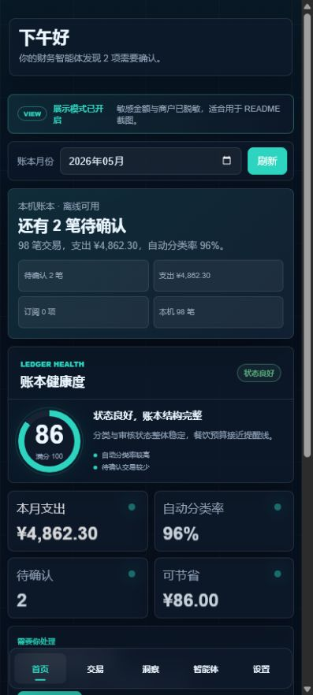
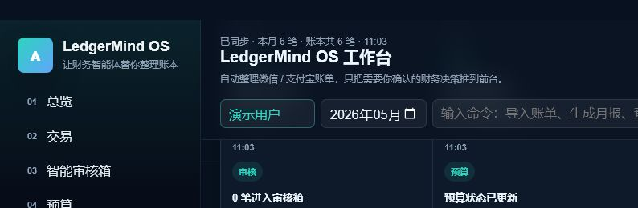
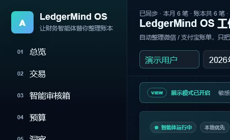
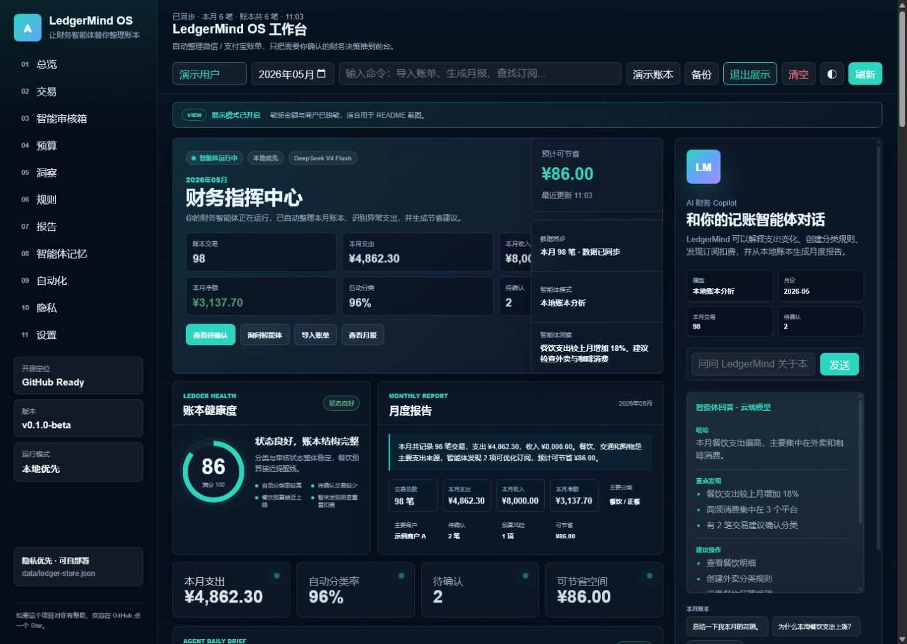

# LedgerMind OS

> 本地优先的中文自动记账智能体 OS


[](./LICENSE)

自动导入微信、支付宝、CSV、XLSX 账单，使用 AI 完成分类、审核、预算分析、月度报告和中文财务问答。

LedgerMind OS 支持人民币账本、本地优先存储、Android 离线运行，以及 SiliconFlow / DeepSeek V4 Flash；云端不可用时会自动回退到本地账本分析。

这不是普通记账 App。LedgerMind OS 提供一条可审计的 Agent 闭环：**账本导入 → AI 分类 → 智能审核 → 任务流建议 → 用户确认 → 操作审计 → 报告输出**。智能体不会擅自修改账本，修改建议必须先进入草稿箱。

## 产品预览


| 移动端首页 | 智能审核箱 |
| --- | --- |
|  |  |





需要重新生成或更新截图时，请参考 [截图指南](./docs/SCREENSHOTS.md)。也可以打开 [Showcase 页面](http://localhost:8787/showcase) 查看响应式产品展示。

## 功能亮点

### 账单导入

- 微信账单、支付宝账单
- CSV / XLSX 文件解析与编码兼容
- 导入结果、重复记录和待确认统计

### AI 自动分类

- 商户规则、用户记忆和置信度判断
- 分类修正后自动学习
- 中文自然语言分类规则

### 智能审核箱

- 集中处理待确认交易、低置信度、预算风险和周期扣费
- 确认、修改、忽略、删除和询问智能体
- 交易状态变更后统计与图表同步更新
- 修改建议先进入本机草稿箱，24 小时后必须重新确认
- 操作审计记录建议、确认、取消和导出结果，不保存 API Key 或账单原文

### 预算与图表

- 月度分类预算、使用进度和月底预测
- 每日趋势、Top 商户、分类占比、来源与收支图表
- 账本健康度和自然语言月度报告
- 数据质量评分及待确认、分类、预算、规则和导入时效修复建议
- 报告中心集中查看月度、预算、订阅、数据质量和导出记录

### 中文财务智能体

- 结论、重点发现、建议操作、数据来源和模型来源
- SiliconFlow / DeepSeek V4 Flash
- 云端失败时自动使用本地账本分析

### 自动化规则与记忆

- 自然语言创建规则，例如“把滴滴自动归为交通”
- 记录用户分类偏好并用于后续交易

### 本地优先与备份

- PC 数据默认保存在 `data/ledger-store.json`
- 支持 JSON 完整备份和 CSV 交易导出
- 展示模式隐藏用户、商户和敏感金额

### Android 离线端

- APK 可在没有 PC 后端时独立管理本地账本
- 支持手工记账、账单导入、分类、预算、月报和本地分析
- 适配 Android 安全区和常见窄屏尺寸

## 快速开始

环境要求：Node.js 20+。

首次打开时，首页会通过“我现在该做什么”给出最多 3 条基于当前账本状态的优先建议，并提供可折叠的四步快速开始：导入账单、处理待确认、询问智能体、查看报告。首次使用引导只自动出现一次，之后可通过首页“快速说明”或设置页“功能地图”重新打开相关说明。

推荐新用户路径：

1. 加载演示账本。
2. 查看智能审核箱。
3. 向智能体提问。
4. 查看报告中心。
5. 导出 Markdown 月报。

智能体不会直接修改账本。规则、预算、记忆和周期扣费等修改建议会先进入待执行草稿箱，并在用户确认后执行和记录操作审计。

```bash
npm install
npm start
```

打开：<http://localhost:8787/>

首次进入后可以：

1. 点击“导入账单”选择微信或支付宝原始 CSV / XLSX。
2. 点击“加载演示账本”进入独立的 `ledgermind-demo` 示例用户。
3. 点击“展示模式”，或访问 `http://localhost:8787/?display=1`。
4. 访问 `http://localhost:8787/showcase` 查看开源展示页。

无数据时首页会显示三步引导：导入账单、查看智能审核箱、询问财务智能体。演示账本固定使用独立用户 `ledgermind-demo`，不会覆盖真实账本；页面顶部会显示“演示账本”提示条，并提供专用的“清除演示账本”按钮。详细说明见 [Demo 指南](./docs/DEMO.md)。

### Docker 启动

已安装 Docker Desktop 的环境可以运行：

```bash
docker compose up --build
```

随后打开 <http://localhost:8787/>。账本通过 `./data:/app/data` 保存在宿主机；模型 Key 建议由本地 `.env` 注入，不要写入镜像或提交到仓库。

容器提供 `/health` 健康检查，并使用非 root 用户运行。停止服务使用 `docker compose down`。

## Showcase 与展示模式

- Showcase：<http://localhost:8787/showcase>
- 展示模式：<http://localhost:8787/?display=1>
- 一键演示账本：<http://localhost:8787/?demo=1>

Showcase 用于 README、演示视频和项目介绍。展示模式只替换页面呈现，不修改真实数据；演示账本则写入隔离的匿名示例用户，可随时单独清除。

GitHub 仓库地址通过 `apps/web/public/index.html` 中的 `github-repo-url` meta 配置。未配置时，界面只显示 Star 提示，不会跳转到假地址。

## Android APK

移动端使用 Capacitor 打包，并可独立离线运行：

```bash
npm run android:apk
```

输出文件：

```text
android/app/build/outputs/apk/debug/app-debug.apk
```

首次配置 Android 构建环境时，请确保已安装 JDK 21 和 Android SDK。`npm run android:sync` 可单独同步 Web 资源。

## 模型配置

复制环境变量模板：

```bash
cp .env.example .env
```

在本机 `.env` 中配置：

```dotenv
SILICONFLOW_BASE_URL=https://api.siliconflow.cn/v1
SILICONFLOW_MODEL_NAME=deepseek-ai/DeepSeek-V4-Flash
SILICONFLOW_API_KEY=your-api-key
```

不要提交 `.env` 或真实 API Key。移动端也可以在“设置”中保存自己的模型配置。没有 Key、请求超时或云端不可用时，智能体会返回本地账本分析结果。

## 数据与隐私

- 移动端账本默认保存在当前设备。
- PC 端账本默认保存在本地 JSON 文件。
- 支持 JSON 备份和 CSV 导出。
- 展示模式可脱敏用户、商户和金额。
- 用户需要自行保管账本、备份文件和 API Key。
- 上传或提交截图前，请确认已经开启展示模式。
- 智能体不会直接修改账本；规则、预算、记忆和周期扣费建议必须由用户确认。
- 待执行草稿、审计日志和导出记录按用户或演示环境隔离保存在当前设备。

完整说明见 [隐私说明](./docs/PRIVACY.md)。

## 系统诊断

在 Web 端侧边栏打开“系统诊断”，或在移动端“设置”页向下查看。诊断区展示本地后端、模型配置、展示模式、账本数量、预算、规则、记忆、最近智能体调用和最近导入状态。无法确认的状态会显示“未检测”“需配置”或“连接失败”，不会伪造成功状态。

## 技术栈

- TypeScript、Node.js 20+ 与原生 Web API
- HTML、CSS、原生 JavaScript 响应式界面
- Capacitor 8 与 Android Gradle 工程
- JSZip 与本地 CSV / XLSX 解析流程
- SiliconFlow OpenAI-compatible API、DeepSeek V4 Flash
- Node.js 内置测试运行器
- Docker Compose 与 GitHub Actions CI

## 项目结构

```text
apps/api/                 Node.js 本地 API 与静态服务
apps/web/public/          PC / 移动端 Web UI 与离线逻辑
packages/core/            Agent OS 核心能力
packages/ledger/          导入、分类、报表、预算与洞察
packages/shared/          共享类型与工具
android/                  Capacitor Android 工程
samples/bills/            匿名示例账单
docs/                     隐私、Demo、路线图和截图说明
Dockerfile                PC Web 容器镜像
docker-compose.yml        本地容器编排与数据卷
```

系统架构与安全执行流程见 [docs/ARCHITECTURE.md](./docs/ARCHITECTURE.md)，开发流程见 [DEV_SPEC.md](./DEV_SPEC.md)。

参与开发请阅读 [CONTRIBUTING.md](./CONTRIBUTING.md)，版本变化见 [CHANGELOG.md](./CHANGELOG.md)。

## 测试状态

当前版本已验证：

- 原有 `16/16` 业务测试继续通过，新增 8 项安全工具测试，总计 `24/24`
- 真实微信 XLSX 账单 `98/98` 行导入成功
- 中文分类规则、待确认同步和预算超支计算正常
- 不同智能体问题返回不同答案
- 展示模式和独立演示账本正常
- Android Debug APK 构建及签名校验通过

运行测试：

```bash
npm test
```

发布前安全扫描：

```bash
npm run check:release
```

CI 位于 `.github/workflows/ci.yml`，使用 Node.js 24 执行依赖安装、发布扫描、构建和单元测试；不注入 API Key，也不构建签名 APK。

## Roadmap

- [ ] 更多微信、支付宝及银行卡账单格式
- [ ] 更多本地模型与 OpenAI-compatible 服务
- [ ] 可选的多端加密同步
- [ ] OCR 票据识别
- [x] Docker Compose 部署
- [ ] 更完整的权限、审计和隐私控制
- [ ] 月报导出为图片 / Markdown
- [ ] 插件系统与记账模板市场

详细规划见 [Roadmap](./docs/ROADMAP.md)。

## License

[MIT](./LICENSE)

如果这个项目对你有帮助，欢迎点一个 Star。
