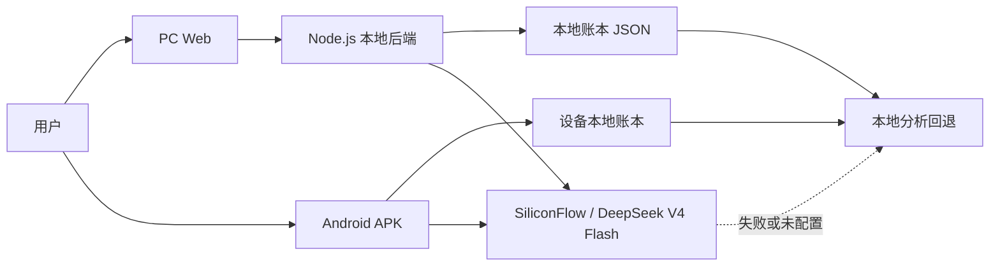
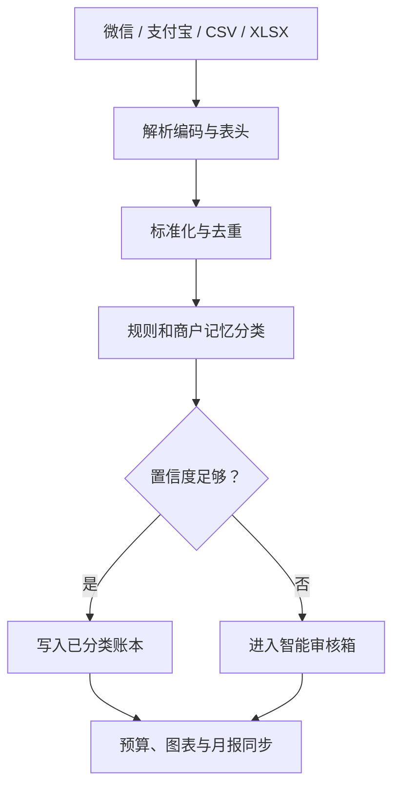
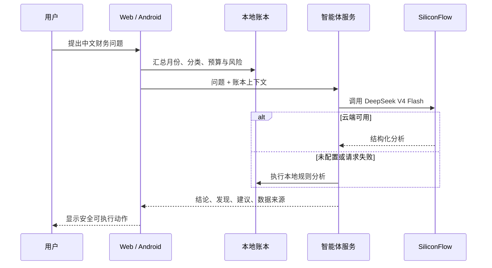
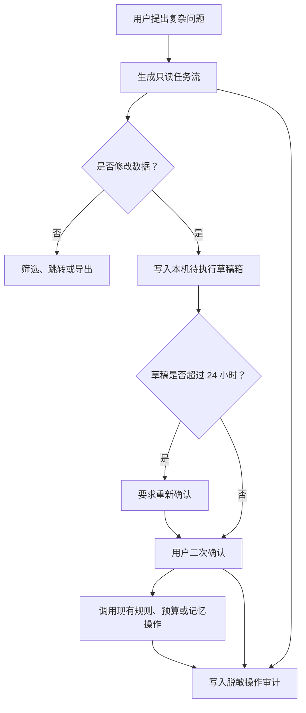

# LedgerMind OS 架构

LedgerMind OS 采用本地优先设计。PC Web 通过同源 Node.js API 管理账本；Android 端在后端不可达时使用设备本地账本与本地分析回退。核心交易结构在双端保持一致。

它不是普通的记账页面，而是一套中文财务 Agent OS：导入形成账本，分类与置信度形成审核任务，智能体生成只读任务流，用户确认修改草稿，审计记录过程，报告中心输出结果。

## 运行组件

- **PC Web 工作台**：提供导入、审核、任务流、草稿箱、数据质量和报告中心。
- **Node.js 本地后端**：提供账本 API、解析编排、分类、预算、洞察、导出和模型代理。
- **Android 离线端**：通过 Capacitor 打包，后端不可用时使用设备本地账本与离线 API 适配层。
- **本地账本数据**：PC 默认写入 `data/ledger-store.json`；Android 使用设备本地存储。
- **模型调用**：可调用 SiliconFlow / DeepSeek V4 Flash；失败时使用本地账本分析。

## 整体架构

## 账单导入流程

导入任务记录来源、成功数、重复数、待确认数和识别月份。交易通过 `importJobId` 关联批次；当前界面支持查看指定批次，不提供非原子批量撤销。

## 智能体分析流程

智能体动作默认只执行跳转、筛选、填充草稿和导出。创建规则、删除交易等数据修改仍要求用户明确确认。

## Agent 任务与安全确认

- 草稿、审计日志和导出记录按真实用户、演示账本和展示模式隔离。
- 审计仅保存操作标题、来源、影响范围和结果，不保存 API Key、账单原文或完整导入文件。
- 数据质量修复建议由待确认率、未分类、重复、商户完整度、预算与规则覆盖率、导入时效及异常数量动态生成。
- 导入批次不提供撤销，避免多笔删除中断后出现部分提交。

## 展示模式与演示账本

- 展示模式只改变呈现层，对用户名、商户和金额进行脱敏。
- 演示账本使用独立用户 `ledgermind-demo`，不覆盖真实用户账本。
- Android 离线端的数据保存在设备本地；PC 数据默认写入 `data/ledger-store.json`。
- 模型 Key 不进入账本备份，也不应提交到 Git。

## 数据质量与报告

数据质量评分基于待确认、未分类、重复、商户完整度、预算覆盖、规则覆盖、导入时效和异常数量。修复建议只执行筛选、跳转或生成待确认草稿。报告中心复用现有账本数据，提供月度、预算、订阅、数据质量和导出记录。

## 隐私与发布边界

- API Key 不写入审计、备份和示例数据。
- 草稿、审计和导出记录按真实用户、演示账本、展示模式划分命名空间。
- Git 忽略本地账本、备份、导入文件、APK、构建目录和签名材料。
- CI 不配置模型密钥，不构建签名 Android 包，只执行发布扫描、构建和测试。

## 关键目录

| 路径 | 作用 |
| --- | --- |
| `apps/web/public` | PC Web 与移动响应式界面 |
| `apps/api` | Node.js API、导入与智能体编排 |
| `packages/core` | 分类、报表、洞察等核心逻辑 |
| `packages/parsers` | 微信、支付宝、CSV、XLSX 解析 |
| `packages/shared` | 双端共享类型 |
| `android` | Capacitor Android 工程 |
| `data` | PC 本地账本运行数据，不提交 Git |
